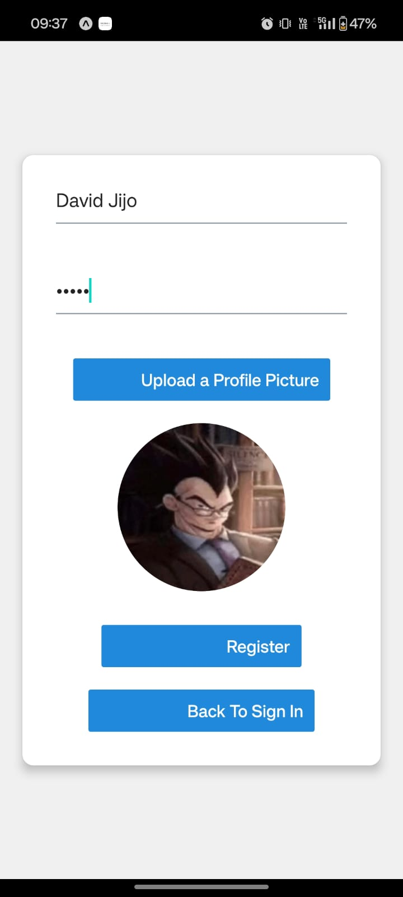
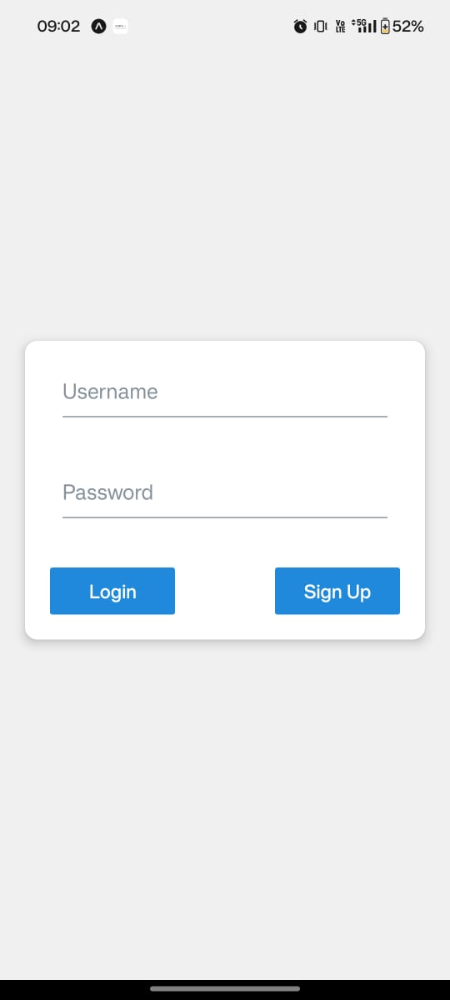
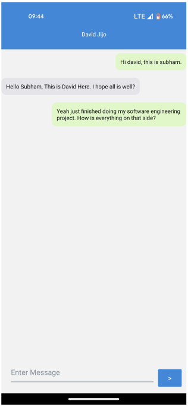

# Echoes: Voice Enhanced Chat Application


Echoes is an accessible chat application that enables users to communicate through both text and voice messaging. It aims to provide a seamless communication experience, particularly for visually impaired users, by allowing interaction via text-to-speech. The project uses react native with rneui for frontend for UI styling, and flask for backend. I made this for a software engineering project, which I feel was way too overkill, should have made an html/css expense tracker. There is a pdf that has the actual SE report. 

## Features
- **User Registration and Authentication**: Secure sign-up and login.
- **Text Messaging**: Real-time text message functionality.
- **Audio Messaging**: Convert Sent Text messages quickly into audio.
- **Contact Management**: Add, edit, and manage contacts.
- **Cross-Platform Accessibility**: Supports Android, iOS, and web.

## Setup and Installation

**Clone the repository:**
```bash
git clone https://github.com/AlliedLens/echoes.git
cd echoes # move into the directory
```
**Install dependencies for python**
```bash
pip install -r requirements.txt
```
**Install dependencies for javascript(includes react native and stuff)**
```bash
npm ci
```
**Setting up the backend**
```bash

#in a new terminal
cd server
python api.py

#open a new terminal
ngrok http 5000 
#keep in mind that you have to go to config.js and paste the new ngrok domain
#also, there might be constant filepaths in require() that need to be changed to that of your PC. 
```

**Opening the app**
```bash
npx expo start #if u want to use it locally
npx expo start --tunnel # if u want to use it on ur phone with expo
```

## Future Enhancements

**Custom Voice Messages**: Possible future update to support personalized voice models for users, enhancing accessibility by fine-tuning TTS with user-specific voice data.

## UI

**Report** [Open Pdf](SE_Final_Report.pdf)




